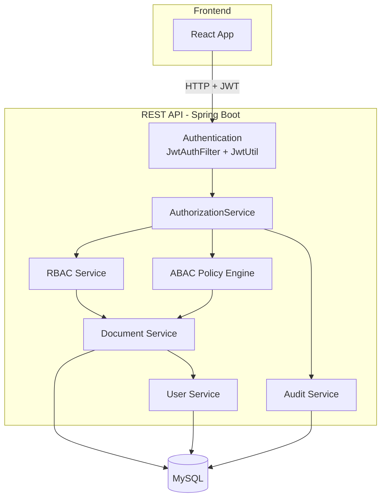
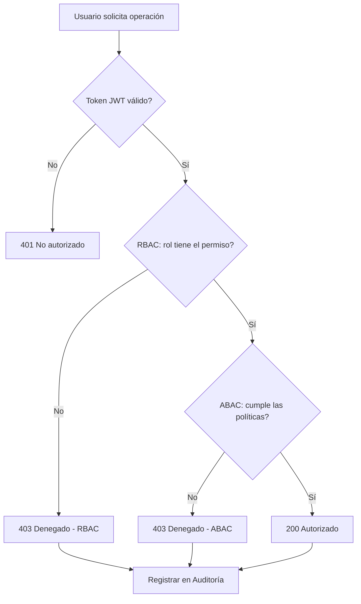

# Diagrama de Arquitectura — SecureDocs

```mermaid
flowchart TB
    subgraph Frontend
        UI[React App]
    end

    subgraph Backend[REST API - Spring Boot]
        AUTH[Authentication<br/>JwtAuthFilter + JwtUtil]
        AUTHZ[AuthorizationService]
        RBAC[RBAC Service]
        ABAC[ABAC Policy Engine]
        DOC[Document Service]
        USR[User Service]
        AUD[Audit Service]
    end

    DB[(MySQL)]

    UI -->|HTTP + JWT| AUTH
    AUTH --> AUTHZ
    AUTHZ --> RBAC
    AUTHZ --> ABAC
    AUTHZ --> AUD
    RBAC --> DOC
    ABAC --> DOC
    DOC --> USR
    DOC --> DB
    USR --> DB
    AUD --> DB
```

## Flujo de autorización

```mermaid
flowchart TD
    A[Usuario solicita operación] --> B{Token JWT válido?}
    B -->|No| Z[401 No autorizado]
    B -->|Sí| C{RBAC: rol tiene el permiso?}
    C -->|No| D[403 Denegado - RBAC]
    C -->|Sí| E{ABAC: cumple las políticas?}
    E -->|No| F[403 Denegado - ABAC]
    E -->|Sí| G[200 Autorizado]
    D --> H[Registrar en Auditoría]
    F --> H
    G --> H
```
