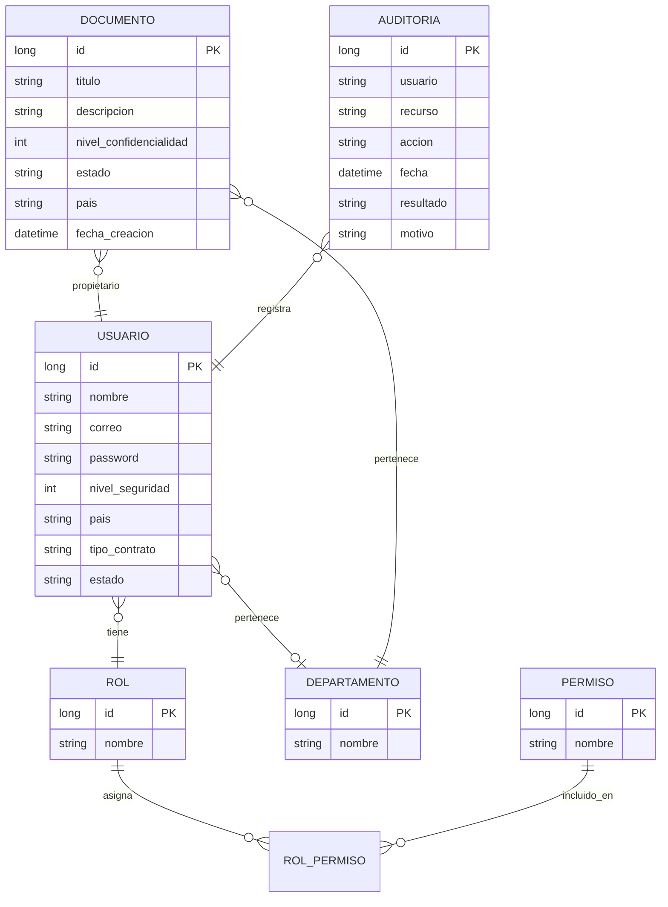

# Modelo de Base de Datos — SecureDocs

```mermaid
erDiagram
    USUARIO }o--|| ROL : tiene
    USUARIO }o--o| DEPARTAMENTO : pertenece
    ROL ||--o{ ROL_PERMISO : asigna
    PERMISO ||--o{ ROL_PERMISO : incluido_en
    DOCUMENTO }o--|| USUARIO : propietario
    DOCUMENTO }o--|| DEPARTAMENTO : pertenece
    AUDITORIA }o--|| USUARIO : registra

    USUARIO {
        long id PK
        string nombre
        string correo
        string password
        int nivel_seguridad
        string pais
        string tipo_contrato
        string estado
    }

    ROL {
        long id PK
        string nombre
    }

    PERMISO {
        long id PK
        string nombre
    }

    DEPARTAMENTO {
        long id PK
        string nombre
    }

    DOCUMENTO {
        long id PK
        string titulo
        string descripcion
        int nivel_confidencialidad
        string estado
        string pais
        datetime fecha_creacion
    }

    AUDITORIA {
        long id PK
        string usuario
        string recurso
        string accion
        datetime fecha
        string resultado
        string motivo
    }
```
